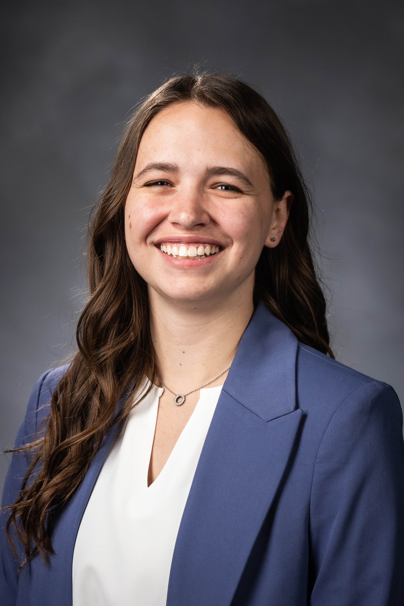

Hi! I’m **Jordan Patten Hardy**: student researcher, social impact–driven engineer, and avid design enthusiast. I’m a Senior Mechanical Engineering student at Brigham Young University, and I believe in engineering for the good of the world.

::: {layout-align="center"}
{width=50% fig-align="center"}
:::

## EDUCATION

* **Bachelor of Science:** Mechanical Engineering, *Brigham Young University*
    * GPA 3.96 | Herbert V. and Berniece B. Kramer Scholarship Recipient
    * Coursework: Manufacturing Processes, Materials Science, Thermodynamics, Heat Transfer, Fluid Dynamics, Computer Aided Design, Dynamic Systems Modeling, Mechatronics

## RESEARCH EXPERIENCE
* **Engineering for Global Health Research** | Provo, Utah (Apr 2025 – Present)
    * Lead mechanical design of a non-invasive perfusion monitor with integrated sensors
    * Conduct technical reviews and prepare documentation for research proposals
* **Disaster Relief and Mitigation Research** | Provo, Utah (Aug 2024 – Apr 2025)
    * Optimized emergency response systems using social impact diffusion models
    * Coauthored a published paper for the ASME IDETC 2025 conference
    * Delivered a technical presentation on a data-driven disaster relief system optimization

*Learn more about BYU's Design Exploration Research Lab work: [design.byu.edu](https://www.design.byu.edu/)*

## WORK EXPERIENCE
* **Student Engineer**, *WesTech Engineering* | Salt Lake City, Utah (May 2026 – August 2026)
    * Designed detailed Process Flow Diagrams (PFDs) and compiled equipment lists for rental water treatment systems.
    * Estimated capital costs for water treatment machinery by directly engaging with external vendors and analyzing quote submissions.
    * Assembled comprehensive engineering proposal packages for client submission under tight deadlines.
* **Mechanical Engineer**, *Crocker Innovation Fellowship* | Provo, Utah (Dec 2025 - Present)
    * Collaborate with an interdisciplinary team to develop a food allergen detection device
    * Develop and execute test protocols to validate device performance
    * Prototype electromechanical systems using C++ firmware and custom circuitry, increasing detection accuracy by 15% through noise reduction
* **Teaching Assistant-Newtonian Mechanics**, *Brigham Young University* | Provo, Utah (Jan 2024 – May 2025)
    * Supported instruction of undergraduates in core engineering and physics concepts
    * Graded assignments and provided detailed feedback to enhance learning

## VOLUNTEER EXPERIENCE
* **Full-time Representative**, *The Church of Jesus Christ of Latter-day Saints* | Reno, Nevada (Jun 2022 – Dec 2023)
    * Completed 18 months of proselyting and community service in Spanish
    * Taught English to 4–8 community members weekly
    * Led groups of 10–12 volunteers and conducted regular training meetings
    * Organized and coordinated region-wide Spanish-language musical devotionals
* **English Teacher**, *International Language Program* | Pachuca, Mexico (Apr 2024 – Aug 2024)
    * Designed and delivered structured English lesson plans for students across multiple age groups
    * Assessed student progress and provided feedback to support language development
    * Collaborated with fellow instructors and local staff to align curriculum goals and classroom strategies
    * Developed cross-cultural communication skills by living and working in an immersive international environment
* **Builder**, *Humanitarian Experience (HXP)* | Cusco, Peru (Jun 2021)
    * Assisted in constructing a community school
    * Gained cross-cultural experience through engagement with local customs and daily life

## SKILLS AND ACHIEVEMENTS
::: {layout-ncol=2}
#### Software & Tools
* Onshape
* SolidWorks 
* Python
* C++ 
* LaTeX  
* Ansys Workbench 
* MATLAB 
* Microsoft Office

#### **Technical Skills** 
* Mechanical design
* Embedded systems
* Computer-aided modeling
* Technical & project documentation
* Data analysis
* Interdisciplinary communication
:::

#### **Certifications** 
* BYU Weidman Center Leadership Certificate (Expected 2027)
* Spanish Language Certificate (Expected 2027)

#### **Awards/Activities** 
* BYU Engineering Together Research Mentorship Award
* Crocker Innovation Fellow, 2026
* Professional Memberships: 
    * The BYU Biomedical Engineering Association (Industry Committee Lead)
    * The American Society of Mechanical Engineers (ASME, member)
    * The Society of Women Engineers (SWE, member)
  

Link to my current [resume](HardyResumeJuly2026.pdf)