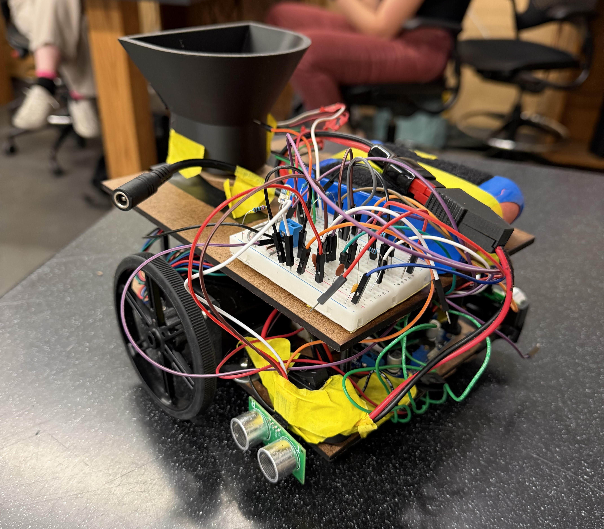
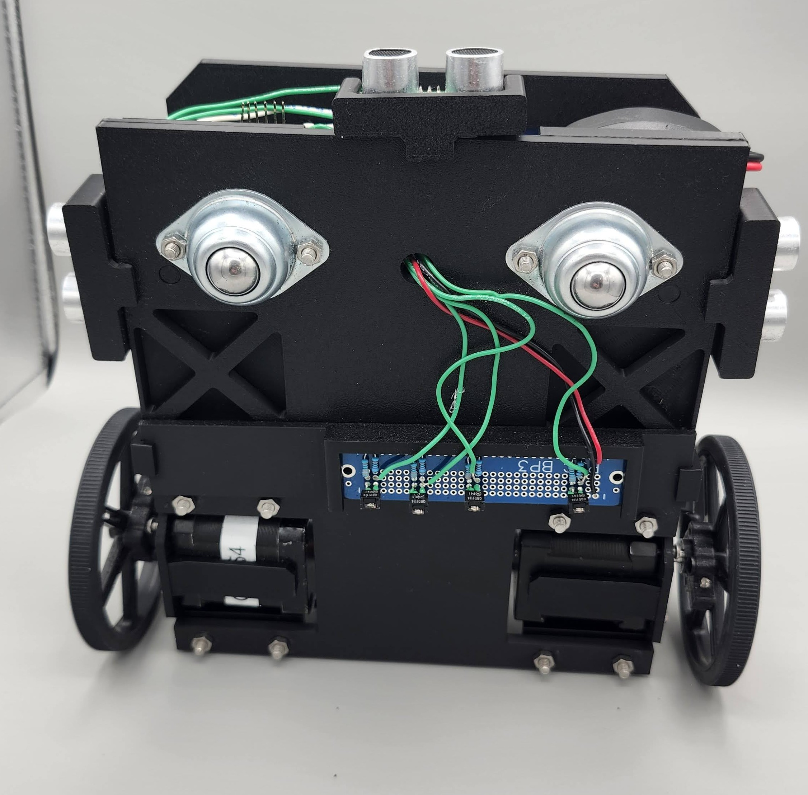
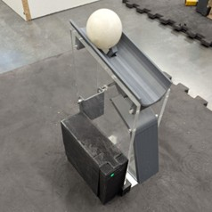
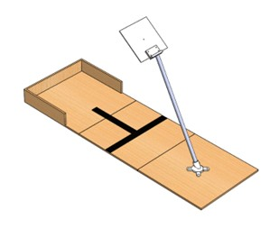
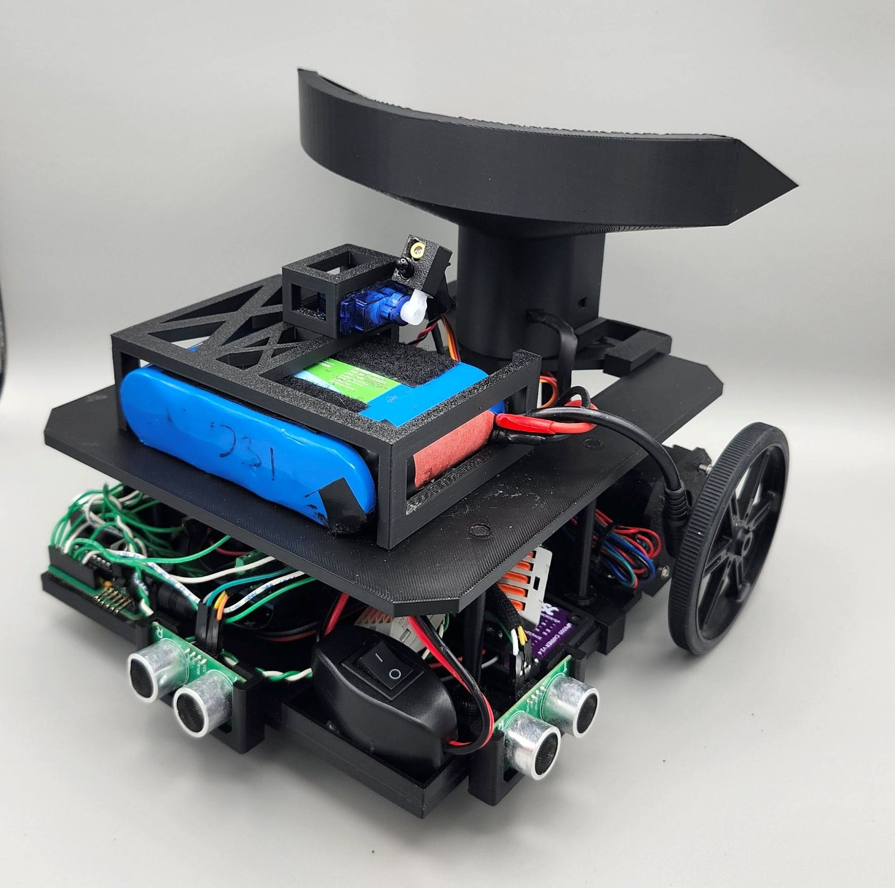

## Project Overview
This project aimed to design and build an autonomous rover capable of executing a course with five distinct tasks placed at randomized locations. Working in a four-person engineering team, we collaborated across mechanical design, electrical systems, and software integration to deliver a fully autonomous mobile platform.

::: {style="text-align: left; margin-left: 20px;"}

{height="300px"}

*An early iteration of our rover*
:::

## Tasks
* **Leave Lander and Line Follow:**
    The rover begins by exiting the lander and locking onto a white guidance track. We achieved this using an underside QRD sensor array, which calculates relative position offset to dynamically adjust motor differential output for precise line tracking.

    {height="300px"}

* **Sample Collection and Return:**
    Using IR and ultrasonic sensors for proximity detection, the rover aligns with the collection station to receive a ping pong ball payload. It then transports the sample and deposits it into the correct bin based on color feedback, leveraging a custom ball capture and release mechanism.

    
    

* **Canyon Navigation:**
    In unmapped sections without guidance lines, the rover transitions to wall-following logic to navigate to the exit. We integrated ultrasonic sensors to detect forward obstacles; when a wall is encountered, the rover evaluates boundary clearances and steers toward open space.

* **Data Transmission:**
    Upon returning to the lander base, the rover locates an active IR beacon and aims a targeting laser at a designated target. A servo-mounted sensor sweeps 180 degrees to identify the peak IR signal intensity, allowing the chassis to align before activating the laser.

    

## Course Completion Run

{height="400px"}

Runtime Video

## Final Rover Iteration
The final build optimized chassis weight distribution, reduced electrical signal noise, and refined sensor placement to establish a robust platform capable of handling unpredictable trial layouts.

{height="300px"}

*Final rover iteration*